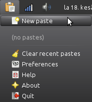

# PasteTray

PasteTray is a tool for using online pastebins. If you have a lot of
text to send to somebody and you don't want to send it in a file you can
use an online pastebin. Just paste your text there, click the paste
button and share the link. Or better yet, use an online pastebin with
PasteTray. This is especially useful for programmers.



These pastebins are supported by default. You can also use them without
PasteTray. Just click the link.

- [dpaste](http://dpaste.com/)
- [Ghostbin](https://ghostbin.com/)
- [GitHub Gist](https://gist.github.com/)
- [hastebin](http://hastebin.com/)
- [Paste ofCode](http://paste.ofcode.org/)

[Writing custom pastebin scripts in Python](writing_pastebins.md) is
also possible.

## License

PasteTray comes with no warranty. See [LICENSE](pastetray/doc/LICENSE).

## Downloading, running and installing

To run PasteTray, you need to install gi with GTK+ 3, Python 3 with PIP
and git if you don't already have them installed. You can also install
AppIndicator3 for gi if you want to have an indicator instead of a tray
icon. Most GNU/Linux distributions come with a lot of these installed,
and you can make sure everything is installed on Debian-based
distributions (such Ubuntu and Linux Mint) by running this on a
terminal.

```
sudo apt-get install git python3-{gi,pip} gir1.2-{gtk-3.0,appindicator3-0.1}
```

When you have everything installed you can download and install
PasteTray. This will install it user-wide, so everything will be inside
your home directory. The `/` in the end of the PIP command is important,
it tells PIP that pastetray is a directory.

```
python3 -m pip install --user git+https://github.com/Akuli/pastetray/
```

Then you can run it like this. A tray icon should appear in your system
tray.

```
.local/bin/pastetray &
```

Uninstalling is easy:

```
python3 -m pip uninstall pastetray
```

I'll make distribution packages (at least a Debian package) of PasteTray
later to make installing and running it easier.

## Authors

I'm Akuli and I have written most of PasteTray, but I want to thank
these people for helping me with it:

- [SquishyStrawberry](https://github.com/SquishyStrawberry/) wrote the
original versions of Paste ofCode and hastebin scripts.
- [Chisight](https://github.com/Chisight/) came up with the idea of
making a pasting application and wrote the original ghostbin pasting
script. His version of it is available in his
[ghostbinit repository](https://github.com/Chisight/ghostbinit).
